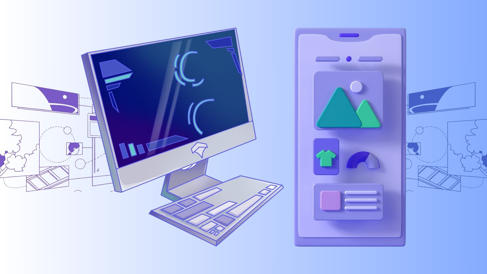
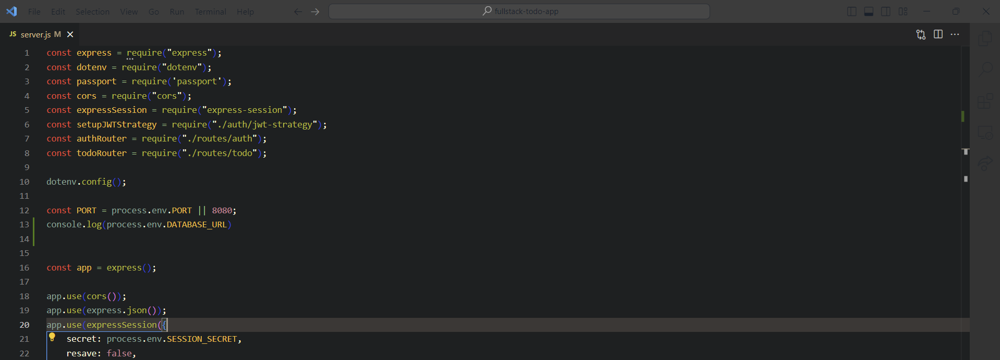

# Welcome to:

## What to Expect In This Lesson

## Review of Prerequisite Material
- What is the internet 
- Client / Server architecture=
- Frontend / Backend
- HTTP

We will review the role of each of technology in the context of web development. It is important to understand how each piece ties to the other and what informs the decisions we make when determining how to assemble our tech stack. In doing so, we will also consider what the goal is for our web application and how our tech stack helps us accomplish said goal.

## Overview of (“Fullstack”) Technologies

As a first lesson, we will not be going extensively into each technology, but rather providing a context for what each technology's role is in the program's tech stack. As the program rolls, each technology will be introduced, then *re-introduced*, applied, and continuously used until you have fully developed a few fullstack web applications, either independently (or with teams).

Think of each technology we introduce as a building block, progressively becoming more challenging while painting a complex picture until the picture is complete. As the challenge increases, it is important to know: ***it does get easier***. What was once challenging in the past will seem like a breeze in the future, so embrace the challenge and look forward to your skillbuilding!

### Frontend:
- [**HTML :**](https://developer.mozilla.org/en-US/docs/Web/HTML) Structure
- [**CSS :**](https://developer.mozilla.org/en-US/docs/Web/CSS) Style
- [**JavaScript :**](https://developer.mozilla.org/en-US/docs/Web/JavaScript) Function
- [**Figma :**](https://www.figma.com/) UX/UI Design
- [**React :**](https://react.dev/) *Frontend* Framework + Efficiency
- (*some*) [**TailwindCSS :**](https://tailwindcss.com/) Style^2

### Backend:
- [**SQL :**](https://developer.mozilla.org/en-US/docs/Glossary/SQL) Database Language
- [**Supabase :**](https://supabase.com/) *Backend* Framework
- [**Prisma :**](https://www.prisma.io/) ORM (Object Relational Model)
- [**Express :**](https://expressjs.com/) Web framework with included web features for web and mobile applications
- [**NodeJS :**](https://nodejs.org/en) JavaScript Runtime environment

Of course, this tech stack is not the end-all-be-all of web development, but it does cover the necessary concepts foundational for any entry-level web developer's skillsets.

## Review of Pre-Training Material
### The Internet

The **internet** is a global network of interconnect computers communicating through a stand set of protocols. It is used to exchange information and resources across the globe. These protocols allow users to send messages, exchange media files such as images, audio, and video, while also allowing for live or realtime streaming such as video conferencing and video streaming. It's what allows you to access this class and communicate with your instructors, classmates, and friends.

### World Wide Web
The **World Wide Web (WWW)** differs from the internet, in that the purpose of the WWW is to consolidate the information or resources received via the internet into a central space such as web pages or web applications. Together, they create a digital experience for users to communicate with each other, use tools, learn, exchange lived experiences, and be connected.

For example, if your personal device is able to connect to your home router or has access to mobile data, you are able to access websites like Facebook or mobile applications like TikTok or Instagram. With a strong enough connection, you can stream videos on YouTube, view live streams on Instagram, and make video calls via Facetime or Zoom.

Without the internet, the WWW would not be able to deliver these reources to users, and without the WWW, the internet, though it can still function, would be less user-friendly.

Our roles as web developers is to create approachability towards web applications so that businesses or services can create an experience users will want to return. Exchanging information can be designed in a user-friendly way, but there are also systems to make the design process more approachable to developers themselves.

This is done through the "***client-server architecture***".

### Client-Server Architecture

**Client-server architecture** is a fundamental concept in web development, in which the system is divided into two main parts: the **client** and the **server**.

Remember how we talked about user-friendly experiences on web pages? That's the client-side. The **server-side** is the internet's ability to respond to the requests made by users on the client-side.

For example, say you are logging onto an account on your computer. You've entered your username and password credentials, and then you press the 'Enter' button on the screen. Clicking the 'Enter' button makes a request to send your credentials to the server-side.

The server is waiting for such requests so that it knows how to appropriately respond. In this case, it needs to verify if your login in *new* or *existing* information.

If this was your first time logging into the account, the server might have a set of instructions on how to respond to the situation.

If your account already exists and you are attempting to login again, the server will attempt to verify your information, ensure it is correct, and then respond in either case.

As developers, we will need to set up all the systems within these procedure to tell both the client-side and the server-side what actions they are allowed to do or how they are meant to respond.

## Frontend Development
Much of what we've covered previously can be found on the *backend* of web development, however, what is just as critical and, to some, just as challenging is **frontend** development.

### Figma

**Figma** is an online service that allows users to conceptualize, design, and prototype various web development features or applications. You can use it to design logos, graphics, GIFs, tables, wireframes, etc.

In our use case, we will use Figma to wireframe and test different designs for our webpages. This will be a useful tool for visualizing what our applications will look like from front to back.

### HTML

**HyperText Markup Language (HTML)** is a markup language we will use to give our webpages sense and *structure*. Some would consider HTML the *bones* to our webpages anatomy.

### CSS

**Cascading Styling Sheets (CSS)** is a styling language we will use to format, design, and beautify our webpages. You can think of it as the aesthetics of our webpage.

### JavaScript

**JavaScript** is a multi-paradigm programming language that can be used on both the frontend *and* the backend of our web development. It is considered the *function* behind the application. It drives the desired behaviors of your web apps. You should be familiar with both use cases by the end of this program.

**Note:** It is important to understand that this program is teaching ***fullstack*** web development, and there will be an expectation to both design *and* develop web applications front to back. The success of your portfolio is contingent on your ability to design aesthetically pleasing webpages, as well as fully functional, bug-free, and accessible features in your applications.

### [Next Section: Introduction to HTML >>](https://github.com/ControlAltTea/test_markdown_canva/blob/main/week_1/week_1_intro_to_HTML.md)