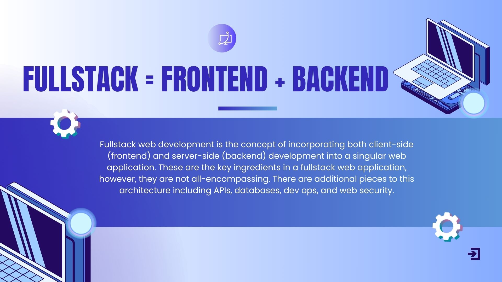

# Welcome to:

# What to Expect Today

## Review of Pre-training Material
- What is the internet 
- Client / Server architecture=
- Frontend / Backend
- HTTP

We will review the role of each of technology in the context of web development. It is important to understand how each piece ties to the other and what informs the decisions we make when determining how to assemble our tech stack. In doing so, we will also consider what the goal is for our web application and how our tech stack helps us accomplish said goal.

## Overview of (“Fullstack”) Technologies
### Frontend:
- HTML: Structure
- CSS: Style
- JavaScript: Function
- Canva: Design
- React: *Frontend* Framework + Efficiency
### Backend:
- SQL: Database Language
- Supabase: *Backend* Framework
- Prisma: ORM (Object Relational Model)
- Express: Web framework with included web features for web and mobile applications
- Node: JavaScript Runtime environment

As a first lesson, we will not be going extensively into each technology, but rather providing a context for what each technology's role is in the program's tech stack. As the program rolls, each technology will be introduced, then *re-introduced*, applied, and continuously used until you have fully developed a few fullstack web applications, either independently or with teams.

Think of each technology we introduce as a building block, progressively becoming more challenging while painting a complex picture until the picture is complete. As the challenge increases, it is important to know: *it does get easier*. What was once challenging in the past will seem like a breeze in the future, so embrace the challenge and look forward to your skillbuilding!

Of course, this is not the end-all-be-all of web development, but it is a necessary foundation for any entry-level web developer.

## Review of Pre-Training Material
### The Internet

> The internet is a global network of interconnected computers that communicate using a standard set of protocols, primarily the Transmission Control Protocol/Internet Protocol (TCP/IP). It enables the sharing of information and resources across vast distances, allowing users to access websites, send emails, stream videos, and much more. - *britannica.com*

### World Wide Web
The world wide web is a major service on the internet that allows for the retrieval and display of information in the form of web pages.

This is done through the "*client-server architecture*".

### Client-Server Architecture

Client-server architecture is a fundamental concept in web development, where the system is divided into two main parts: the client and the server.

> Web browsers communicate with web servers using the HyperText Transfer Protocol (HTTP). When you click a link on a web page, submit a form, or run a search, an HTTP request is sent from your browser to the target server.

> Web servers wait for client request messages, process them when they arrive, and reply to the web browser with an HTTP response message. The response contains a status line indicating whether or not the request succeeded (e.g. "HTTP/1.1 200 OK" for success).

> The request includes a URL identifying the affected resource, a method that defines the required action (for example to get, delete, or post the resource), and may include additional information encoded in URL parameters (the field-value pairs sent via a query string), as POST data (data sent by the HTTP POST method), or in associated cookies.

> Web servers wait for client request messages, process them when they arrive, and reply to the web browser with an HTTP response message. The response contains a status line indicating whether or not the request succeeded (e.g. "HTTP/1.1 200 OK" for success).

> The body of a successful response to a request would contain the requested resource (e.g. a new HTML page, or an image), which could then be displayed by the web browser.

## Frontend Development
Much of what we've covered previously can be found on the *backend* of web development, however, what is just as critical and, to some, just as challenging is **frontend** development.

**The key frontend technologies we will be using include:**
- Canva
- HTML
- CSS
- JavaScript
- React
- (*some*) TailwindCSS

### Figma

**Figma** is an online service that allows users to conceptualize, design, and prototype various web development features or applications. You can use it to design logos, graphics, GIFs, tables, wireframes, etc.

In our use case, we will use Figma to wireframe and test different designs for our webpages. This will be a useful tool for visualizing what our applications will look like from front to back.

### HTML

**HTML** is a markdown language we will use to give our webpages sense and *structure*. Some would consider HTML the *bones* to our webpages anatomy.

### CSS

**CSS** is a styling language we will use to format, design, and beautify our webpages. You can think of it as the aesthetics of our webpage.

### JavaScript

**JavaScript** is a multi-paradigm programming language that can be used on both the frontend *and* the backend of our web development. It is considered the *function* behind the application. It drives the desired behaviors of your web apps. You should be familiar with both use cases by the end of this program.

It is important to note that this program is teaching ***fullstack*** web development, and there will be an expectation to both design *and* develop the web applications front to back. The success of your portfolio is contingent on your ability to design aesthetically pleasing webpages, as well as fully functional and accessible features.