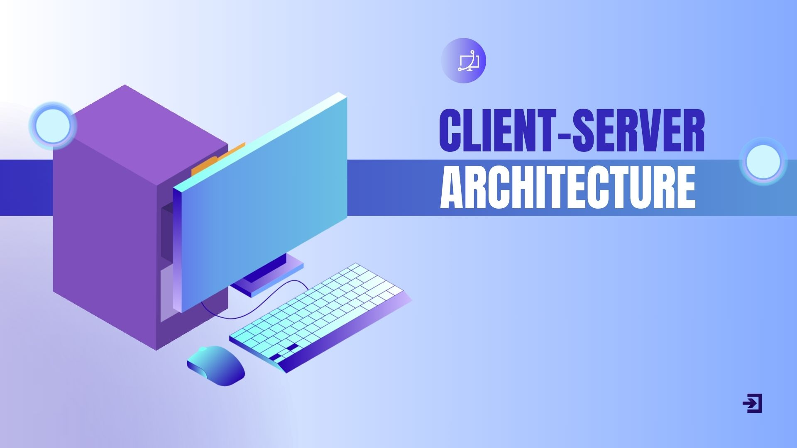

# Welcome to:

# What to Expect Today

## Review of Pre-training Material
- What is the internet 
- Client / Server architecture=
- Frontend / Backend
- HTTP

We will review the role of each of these in the context of web development. It is important to understand how each topic ties to the other and what informs the decisions we make when utilizing each technology.

## Overview of (“Fullstack”) Technologies
### Frontend:
- HTML
- CSS
- JavaScript
- Figma
- React
### Backend:
- SQL
- Supabase
- Prisma
- Express
- Node

As a first lesson, we will not be going extensively into each technology, but rather providing a context for what each technology's role is in the program's tech stack. As the program rolls, each technology will be introduced, then *re-introduced*, applied, and continuously used until you have fully developed a fullstack web application.

Think of each technology we introduce as a building block, progressively becoming more challenging, until the picture is complete. Of course, these is not the end-all-be-all of web development, but it is a necessary foundation for any entry-level web developer.

## Review of Pre-Training Material
### The Internet

> The internet is a global network of interconnected computers that communicate using a standard set of protocols, primarily the Transmission Control Protocol/Internet Protocol (TCP/IP). It enables the sharing of information and resources across vast distances, allowing users to access websites, send emails, stream videos, and much more. - *britannica.com*

### World Wide Web
The world wide web is a major service on the internet that allows for the retrieval and display of information in the form of web pages.

This is done through the "*client-server architecture*".

### Client-Server Architecture

Client-server architecture is a fundamental concept in web development, where the system is divided into two main parts: the client and the server.

> Web browsers communicate with web servers using the HyperText Transfer Protocol (HTTP). When you click a link on a web page, submit a form, or run a search, an HTTP request is sent from your browser to the target server.

> Web servers wait for client request messages, process them when they arrive, and reply to the web browser with an HTTP response message. The response contains a status line indicating whether or not the request succeeded (e.g. "HTTP/1.1 200 OK" for success).

> The request includes a URL identifying the affected resource, a method that defines the required action (for example to get, delete, or post the resource), and may include additional information encoded in URL parameters (the field-value pairs sent via a query string), as POST data (data sent by the HTTP POST method), or in associated cookies.

> Web servers wait for client request messages, process them when they arrive, and reply to the web browser with an HTTP response message. The response contains a status line indicating whether or not the request succeeded (e.g. "HTTP/1.1 200 OK" for success).

> The body of a successful response to a request would contain the requested resource (e.g. a new HTML page, or an image), which could then be displayed by the web browser.